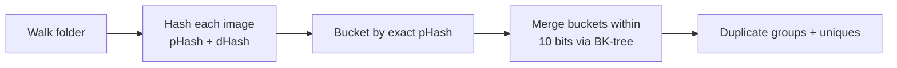

# Pixel Sweeper

Finds near-duplicate images in a folder and lets you clean them up in a visual gallery — tick the
copies you don't want, press one button, and they go to the recycle bin.

Built with PyQt6 and Pillow. Ships as a single-file Windows executable.

## What it does

- **Scans a folder** (recursively) and hashes every image with two perceptual hashes.
- **Groups near-duplicates** by Hamming distance, so mildly edited, resized or recompressed copies
  are still caught — not just byte-identical files.
- **Shows images as they are scanned** instead of leaving the gallery empty until the end.
- **Tick boxes on every thumbnail** so you choose exactly what to remove.
- **Deletes to the recycle bin** (recoverable), then re-scans automatically. Nothing else is touched.
- **Shows the space wasted** on duplicates, in the status bar and per group.

## Requirements

- Windows for the packaged build and the instructions below; the app itself is plain PyQt6 and runs
  from source on other platforms
- Python 3.10 or newer — developed and tested on 3.14
- `PyQt6` and `Pillow`, installed automatically below

## Install and run

```powershell
# From the project root
python -m venv .venv
.\.venv\Scripts\Activate.ps1
pip install -e .

python main.py                  # then pick a folder in the app
python main.py D:\Pictures      # or open straight onto a folder
```

Three equivalent entry points:

| Command | Notes |
| --- | --- |
| `python main.py [folder]` | Simplest from a checkout |
| `python -m image_duplicates [folder]` | Same, as a module |
| `image-dup [folder]` | Console script, available once installed |

The app remembers the last folder and re-opens it on the next launch.

Using `uv` instead of pip, since a `uv.lock` is committed:

```powershell
uv sync                          # runtime dependencies
uv sync --extra dev              # plus PyInstaller
uv run main.py D:\Pictures
```

## Build a standalone executable

```powershell
pip install -e ".[dev]"          # adds PyInstaller
pyinstaller --clean --noconfirm PixelSweeper.spec
```

That produces a single-file, windowed `dist\PixelSweeper.exe` (about 42 MB). `PixelSweeper.spec`
excludes the large PyQt6 bindings the app never touches, which is what keeps the size down.

> **Note:** a one-file executable runs as a parent + child process pair. If a copy is still running,
> the next build fails with `PermissionError: [WinError 5]`. Close the app (check Task Manager for
> stray `PixelSweeper` processes) and build again.

## How it works



1. **Every image is hashed twice** — a DCT-based pHash (32×32 greyscale, low-frequency 8×8 block,
   median threshold) and a cheap horizontal dHash. Both are 64-bit values.
2. **Images sharing an exact pHash** form a bucket.
3. **Buckets are merged** when their hashes are within a Hamming distance of **10 bits**. A BK-tree
   keeps that pairwise search fast on large libraries.
4. **Buckets with two or more images** become duplicate groups; the rest are the unique set.

Hashing runs in a thread pool, which overlaps file reading and image decoding across images. Note that
the DCT itself is pure Python, so that part is serialised by the GIL — the pool mainly hides the I/O
and decode cost.

### Caching

Two caches make repeat scans fast, both under the app-data folder:

- **Hash index** — a per-folder JSON file keyed by folder path. Each entry stores size, mtime, and the
  hashes, so unchanged files are never re-opened or re-hashed. Changed or new files are re-hashed.
- **Thumbnails** — decoded once and written as PNGs, so re-opening a folder is instant.

A cancelled or interrupted scan still keeps the hashes it completed, so the next scan of that folder
only does the remaining work.

## Using the gallery

Select a node in the tree on the left — a duplicate group, or **Click to browse all unique images** —
and the matching thumbnails appear on the right.

| Action | How |
| --- | --- |
| Tick / untick an image | Click the box in the caption row under the thumbnail |
| Tick everything | **Check All** |
| Clear all ticks | **Uncheck All** |
| Keep one copy of a group | **Check All Except First** — ticks every image but the first |
| Tick several at once | Rubber-band or Ctrl/Shift-click, then press **Space** |
| Delete what is ticked | **Delete Checked (n)**, or press **Delete** |
| Preview an image full size | Double-click a thumbnail; **Left/Right** arrows move between images |
| Delete the image on screen | In the preview, **Delete This Image** or press **Delete** |
| Stop a long scan | **Cancel** in the toolbar |

Deleting asks for confirmation with a count and total size, moves the files to the recycle bin, then
re-scans so the gallery reflects reality. Files you did not tick are never touched.

The full-size preview deletes the image it is showing, without needing to tick it first — useful when you
want a closer look before deciding. It closes itself once the file has gone, since the list behind it is
now stale, and stays open if you cancel the confirmation.

**Cancel** stops the running scan *and* drops any folder queued behind it. Since the hashes already
computed are kept, cancelling a long scan doesn't throw the work away. If results were on screen
before you started, they are put back.

## Where it keeps its data

Both caches live under the Qt app-data location:

| How it runs | Cache folder |
| --- | --- |
| `python main.py` | `%APPDATA%\python\` |
| `PixelSweeper.exe` | `%APPDATA%\PixelSweeper\` |

Each holds `index\` (hash index) and `thumbs\` (thumbnail PNGs). They are safe to delete at any time —
the next scan just takes longer. Deleting a file in the app also evicts its cached thumbnail.

Because the two names differ, the executable and a development run keep separate caches.

## Project layout

```
main.py                     # entry point: python main.py [folder]
PixelSweeper.spec           # PyInstaller build definition
image_duplicates/
    gallery.py              # PyQt6 window, gallery view, scan thread
    scanner.py              # folder walk, hash index cache, duplicate grouping
    hashing.py              # pHash and dHash implementations
    __main__.py             # python -m image_duplicates
pyproject.toml              # project metadata, dependencies, dev extra
uv.lock                     # pinned dependency lock file
```

## Development notes

There is no test suite; GUI behaviour was verified with throwaway offscreen scripts using this recipe:

```python
import os
os.environ.setdefault("QT_QPA_PLATFORM", "offscreen")

from PyQt6.QtTest import QTest          # real mouse/key events
from PyQt6.QtGui import QPixmap

# ... build widgets, then:
pixmap = QPixmap(widget.size())
widget.render(pixmap)                   # render to a pixmap to assert on pixels
```

`QTest.mouseClick(...)` drives genuine click handling, and `QWidget.render()` lets you assert on what
was actually painted — which is how the tick box was confirmed never to overlap the picture.

Supported image types: `.jpg`, `.jpeg`, `.png`, `.gif`, `.bmp`, `.webp`, `.tif`, `.tiff`, `.ico`, `.qoi`.

## Known limitations

- The similarity threshold is **fixed at 10 bits**; the toolbar shows it but there is no control to
  change it yet. Two images that look alike but differ more than that will not be grouped.
- Deletion always goes to the recycle bin. There is no permanent-delete option, and files on network
  or removable drives without a recycle bin cannot be moved (the app reports which ones failed).
- Ticking is disabled while a scan is running: the preview is a flat list of everything found so far,
  not the final groups, so ticks made there would be discarded at the end.
- Only one folder can be queued behind a running scan; a newer request replaces it.
