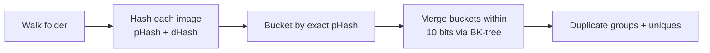

# Pixel Sweeper

Finds near-duplicate images in a folder and lets you clean them up in a visual gallery — tick the
copies you don't want, press one button, and they go to the recycle bin.

Built with PyQt6 and Pillow. Ships as a single-file Windows executable.

## What it does

- **Scans a folder** (recursively) and hashes every image with two perceptual hashes.
- **Groups near-duplicates** by Hamming distance, so mildly edited, resized or recompressed copies
  are still caught — not just byte-identical files.
- **Shows images as they are scanned** instead of leaving the gallery empty until the end.
- **Tick boxes on every thumbnail** so you choose exactly what to remove.
- **Deletes to the recycle bin** (recoverable), then re-scans automatically. Nothing else is touched.
- **Shows the space wasted** on duplicates, in the status bar and per group.

## Requirements

- Windows for the packaged build and the instructions below; the app itself is plain PyQt6 and runs
  from source on other platforms
- Python 3.10 or newer — developed and tested on 3.14
- `PyQt6` and `Pillow`, installed automatically below

## Install and run

```powershell
# From the project root
python -m venv .venv
.\.venv\Scripts\Activate.ps1
pip install -e .

python main.py                  # then pick a folder in the app
python main.py D:\Pictures      # or open straight onto a folder
```

Three equivalent entry points:

| Command | Notes |
| --- | --- |
| `python main.py [folder]` | Simplest from a checkout |
| `python -m image_duplicates [folder]` | Same, as a module |
| `image-dup [folder]` | Console script, available once installed |

The app remembers the last folder and re-opens it on the next launch.

Using `uv` instead of pip, since a `uv.lock` is committed:

```powershell
uv sync                          # runtime dependencies
uv sync --extra dev              # plus PyInstaller
uv run main.py D:\Pictures
```

## Build a standalone executable

```powershell
pip install -e ".[dev]"          # adds PyInstaller
pyinstaller --clean --noconfirm PixelSweeper.spec
```

That produces a single-file, windowed `dist\PixelSweeper.exe` (about 42 MB). `PixelSweeper.spec`
excludes the large PyQt6 bindings the app never touches, which is what keeps the size down. It also
embeds `assets\pixelsweeper.ico` into the executable and bundles it as a data file, so the icon
appears in Explorer, the taskbar and the window title bar (and the source run picks up the same file
from `assets\`).

> **Note:** a one-file executable runs as a parent + child process pair. If a copy is still running,
> the next build fails with `PermissionError: [WinError 5]`. Close the app (check Task Manager for
> stray `PixelSweeper` processes) and build again.

## How it works



1. **Every image is hashed twice** — a DCT-based pHash (32×32 greyscale, low-frequency 8×8 block,
   median threshold) and a cheap horizontal dHash. Both are 64-bit values.
2. **Images sharing an exact pHash** form a bucket.
3. **Buckets are merged** when their hashes are within the **similarity threshold**, fixed at **10 bits**. A BK-tree keeps that pairwise search fast on large libraries.
4. **Buckets with two or more images** become duplicate groups; the rest are the unique set.

The walk covers the whole tree at any depth. Folder links (symlinks and junctions) are followed, so a
subfolder kept behind one is still scanned, with a set of real paths preventing a link cycle from being
walked twice or looping. Folders that cannot be read are reported rather than skipped in silence.

Large photos are handled: the dimensions come from the file header, and JPEGs are decoded at reduced
scale, so a 200 MP phone photo costs a few MB of memory instead of roughly 600 MB. Pillow's default
pixel ceiling is raised past any real camera, since it otherwise refuses such files as suspected
"decompression bombs" — which is exactly what a 200 MP photo looks like by its numbers.

Hashing runs in a thread pool, which overlaps file reading and image decoding across images. Note that
the DCT itself is pure Python, so that part is serialised by the GIL — the pool mainly hides the I/O
and decode cost.

### Caching

Two caches make repeat scans fast, both under the app-data folder:

- **Hash index** — a per-folder JSON file keyed by folder path. Each entry stores size, mtime, and the
  hashes, so unchanged files are never re-opened or re-hashed. Changed or new files are re-hashed.
- **Thumbnails** — decoded once and written as PNGs, so re-opening a folder is instant.

A cancelled or interrupted scan still keeps the hashes it completed, so the next scan of that folder
only does the remaining work.

## Using the gallery

Select a node in the tree on the left — a duplicate group, **Unique Images**, or **Scanned Folders** — and
the matching thumbnails appear on the right. Group headings name the subfolder the image came from, so you
can tell at a glance which folders a scan covered.

| Action | How |
| --- | --- |
| Browse everything one folder contributed | **Scanned Folders** in the tree lists every folder that produced an image, with its count |
| See how alike two images must be | The toolbar shows the **similarity threshold**, fixed at 10 bits |
| Tick / untick an image | Click the box in the caption row under the thumbnail |
| Tick everything | **Check All** |
| Clear all ticks | **Uncheck All** |
| Keep one copy of a group | **Check All Except First** — ticks every image but the first |
| Tick several at once | Rubber-band or Ctrl/Shift-click, then press **Space** |
| Delete what is ticked | **Delete Checked (n)**, or press **Delete** |
| Preview an image | Double-click a thumbnail; it opens fitted to the window |
| See a photo at 1:1 | **Actual size** in the preview — it then scrolls both ways |
| Move between images | **Left/Right** arrows, or **Prev**/**Next** |
| Delete the image on screen | In the preview, **Delete This Image** or press **Delete** |
| Stop a long scan | **Cancel** in the toolbar |

Deleting asks for confirmation with a count and total size, moves the files to the recycle bin, then
re-scans so the gallery reflects reality. Files you did not tick are never touched.

The preview opens **fitted to the window**, so the first thing you see is the whole picture rather than a
corner of it, and it re-fits as you resize the window. **Actual size** switches to 1:1 with scroll bars in
both directions, and the caption always says which you are looking at — `fitted to the window (776 x 194)`
or `shown at full size`. A photo smaller than the window is left at its own size rather than being stretched.
The preview can also delete the image on screen without ticking it first — useful when you want a closer
look before deciding — closes itself once the file has gone, since the list behind it is now stale, and
stays open if you cancel the confirmation.

**Cancel** stops the running scan *and* drops any folder queued behind it. Since the hashes already
computed are kept, cancelling a long scan doesn't throw the work away. If results were on screen
before you started, they are put back.

## Where it keeps its data

Both caches live under the Qt app-data location:

| How it runs | Cache folder |
| --- | --- |
| `python main.py` | `%APPDATA%\python\` |
| `PixelSweeper.exe` | `%APPDATA%\PixelSweeper\` |

Each holds `index\` (hash index) and `thumbs\` (thumbnail PNGs). They are safe to delete at any time —
the next scan just takes longer. Deleting a file in the app also evicts its cached thumbnail.

Because the two names differ, the executable and a development run keep separate caches.

## Project layout

```
main.py                     # entry point: python main.py [folder]
PixelSweeper.spec           # PyInstaller build definition
assets/
    pixelsweeper.svg        # icon artwork, full detail (used from 32 px up)
    pixelsweeper-small.svg  # icon artwork, simplified (used below 32 px)
    make_icon.py            # renders both to a multi-size .ico and a .png
    pixelsweeper.ico        # the icon the app and the executable use
    pixelsweeper-256.png    # preview copy of the icon
image_duplicates/
    gallery.py              # PyQt6 window, gallery view, scan thread
    scanner.py              # folder walk, hash index cache, duplicate grouping
    hashing.py              # pHash and dHash implementations
    __main__.py             # python -m image_duplicates
pyproject.toml              # project metadata, dependencies, dev extra
uv.lock                     # pinned dependency lock file
```

The icon is generated, not hand-drawn per size — edit the SVG and rebuild it:

```powershell
.venv\Scripts\python.exe assets\make_icon.py
```

That writes every size from 16 to 256 px as a native render, switches to the simplified artwork
below 32 px so it stays readable at small sizes, and updates `pixelsweeper.ico` plus the 256 px PNG.

## Development notes

There is no test suite; GUI behaviour was verified with throwaway offscreen scripts using this recipe:

```python
import os
os.environ.setdefault("QT_QPA_PLATFORM", "offscreen")

from PyQt6.QtTest import QTest          # real mouse/key events
from PyQt6.QtGui import QPixmap

# ... build widgets, then:
pixmap = QPixmap(widget.size())
widget.render(pixmap)                   # render to a pixmap to assert on pixels
```

`QTest.mouseClick(...)` drives genuine click handling, and `QWidget.render()` lets you assert on what
was actually painted — which is how the tick box was confirmed never to overlap the picture.

Supported image types: `.jpg`, `.jpeg`, `.png`, `.gif`, `.bmp`, `.webp`, `.tif`, `.tiff`, `.ico`, `.qoi`.
Anything else is passed over — including formats Pillow needs a plugin for, such as HEIC or AVIF.

## Known limitations

- **Anything the scan could not read is reported, not hidden.** Folders it could not list and images it
  could not hash are counted at the end of the status bar (`3 folder(s) unreadable`), and hovering that
  text lists the paths and the reason. If images you expect are missing, check there first.
- The similarity threshold is deliberately strict at 10 bits: it matches re-saved copies and rapid bursts,
  but not shots of the same scene taken seconds apart, which typically land 12–18 bits apart. Two images
  that look alike to you but land 11+ bits apart are reported as unique rather than grouped, and the
  toolbar shows the fixed value so it is never a surprise. Changing it means changing
  `DEFAULT_THRESHOLD` in `image_duplicates/scanner.py` and re-scanning.
- **Actual size** shows a photo at up to **4096 px** on its longest side — 1:1 on any screen, but a
  downscaled copy for anything larger, such as a 200 MP photo. The caption says when it has scaled, so it is
  not a pixel-peeping tool for images beyond that.
- Deletion always goes to the recycle bin. There is no permanent-delete option, and files on network
  or removable drives without a recycle bin cannot be moved (the app reports which ones failed).
- Ticking is disabled while a scan is running: the preview is a flat list of everything found so far,
  not the final groups, so ticks made there would be discarded at the end.
- Only one folder can be queued behind a running scan; a newer request replaces it.
